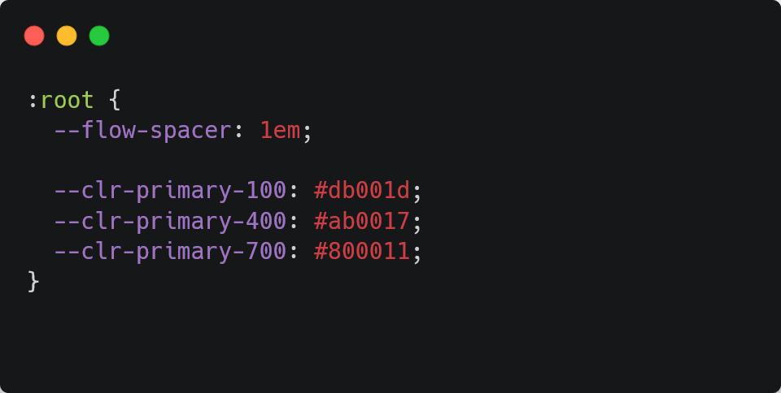

Lorem ipsum dolor sit amet, consectetur adipiscing elit. Phasellus nec sodales urna. Vestibulum sit amet odio neque. Donec laoreet felis at ultricies scelerisque. Nunc tincidunt, enim vitae commodo efficitur, nisl purus commodo enim, id malesuada magna massa faucibus ipsum. Vestibulum tincidunt ante quis interdum rutrum. Nam quis sapien tortor. Fusce id vulputate dui. Donec quis gravida tortor, eget consequat ligula. Curabitur commodo nunc sed nulla gravida, sed elementum nulla rhoncus. Vestibulum vehicula fermentum purus et interdum. Pellentesque et ornare tortor. Integer vel placerat lectus, id rhoncus sem.



Sed hendrerit ante at arcu venenatis lobortis. Aliquam vitae rhoncus metus. Donec sapien lectus, efficitur ut diam vitae, porta porttitor quam. Suspendisse feugiat mauris enim, et semper enim vulputate vel. In vel neque lectus. Nulla pulvinar bibendum tempus. Cras facilisis lobortis augue quis condimentum. Cras eget purus dictum, posuere enim at, blandit velit. Maecenas aliquet molestie dolor. Fusce vel tellus at enim euismod eleifend.

Vivamus ac justo quis est ultricies semper in sed elit. Donec vestibulum elit et sem malesuada, quis pellentesque magna pulvinar. Quisque ut cursus nunc. Vestibulum vel porttitor dolor. Morbi iaculis eleifend urna in tempor. Donec porttitor tempor mi, blandit feugiat neque condimentum a. Phasellus hendrerit, nulla nec convallis placerat, sem risus finibus nunc, sit amet tempus quam dui id leo. Duis libero tellus, rhoncus id velit in, venenatis congue lorem. Donec varius semper velit, ac rutrum quam dignissim ac. Aenean in arcu et nisl dictum ultricies.

```js
const scrollEl = document.querySelector("#my-scroll")

scrollEl.on("scroll", () => {
    console.log("hello world")
})
```